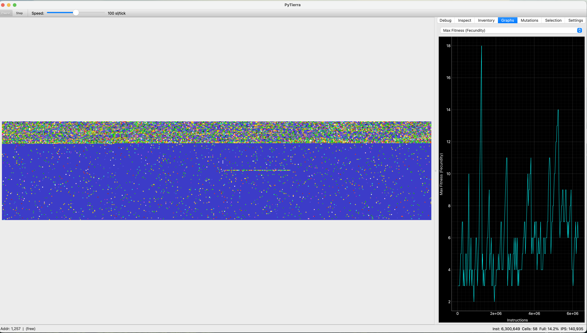

# PyTierra

Python reimplementation of Tom Ray's **Tierra 6.02** artificial life simulator.

Tierra creates a virtual world where self-replicating programs compete for CPU time and memory. Through mutation and natural selection, digital organisms evolve new strategies — shorter replicators, parasites that steal code from neighbors, and hosts that develop immunity.



## Features

- **Full Tierra 6.02 simulation engine** — all 32 instructions, memory allocator, scheduler, reaper, genebank, mutation operators
- **GUI with real-time visualization** — soup view with zoom/pan, cell/IP/fecundity overlays
- **7 inspector tabs** — Debug (CPU state + disassembly), Inspect (genotype viewer), Inventory (population table), Graphs (6 time-series + 2 histograms), Mutations, Selection, Settings
- **Genebank** — SQLite-backed genotype database with auto-collection, export, and injection
- **Save/Load sessions** — full simulation state persistence (`.pytierra` files)
- **Export** — soup PNG images and graph CSV data
- **CLI** — headless simulation runs and profiling (`pytierra profile`)
- **Configurable** — Tierra si0 config file compatibility, all parameters adjustable at runtime
- **Dark mode** — automatic system theme detection

## Installation

### With uv (recommended)

```bash
git clone https://github.com/7robots/PyTierra.git
cd PyTierra
uv sync --extra gui
```

### With pip

```bash
git clone https://github.com/7robots/PyTierra.git
cd PyTierra
pip install -e ".[gui]"
```

The `gui` extra installs PySide6 and pyqtgraph. Omit it for headless/CLI usage.

## Quick Start

### GUI

```bash
pytierra-gui
```

Or:

```bash
pytierra gui
```

A dialog will prompt you to configure soup size and ancestor genome. Click OK to begin, then press **Space** to start evolution.

### CLI

```bash
# Run 10 million instructions with the default ancestor
pytierra run --ancestor data/genomes/0080aaa.tie -n 10M

# Profile performance
pytierra profile -n 1M
```

### Keyboard Shortcuts

| Key | Action |
|-----|--------|
| Space | Play / Pause |
| Right | Step one slice |
| `]` / `[` | Speed up / down |
| Cmd+S | Save session |
| Cmd+O | Open session |
| Cmd+G | Genebank window |
| F1 | Help |

## Documentation

See the [docs/](docs/) directory:

- [User Guide](docs/user-guide.md) — getting started, first simulation, understanding output
- [Instruction Set](docs/instruction-set.md) — all 32 instructions with pseudo-code
- [Parameters](docs/parameters.md) — every configuration field explained
- [Ancestor Organism](docs/ancestor.md) — annotated disassembly of 0080aaa
- [Architecture](docs/architecture.md) — module diagram and engine design
- [Genebank](docs/genebank.md) — naming convention, storage, .tie format
- [GUI Reference](docs/gui-reference.md) — tabs, overlays, keyboard shortcuts
- [Troubleshooting](docs/troubleshooting.md) — common issues and solutions

## Compatibility

- Python 3.10+
- macOS, Linux, Windows
- PySide6 6.5+ (for GUI)

## License

MIT

## Acknowledgments

Based on the original [Tierra](http://life.ou.edu/tierra/) system created by **Thomas S. Ray** at the University of Oklahoma. Tierra was first described in:

> Ray, T. S. (1991). "An approach to the synthesis of life." In *Artificial Life II*, Santa Fe Institute Studies in the Sciences of Complexity, vol. XI, pp. 371-408.
